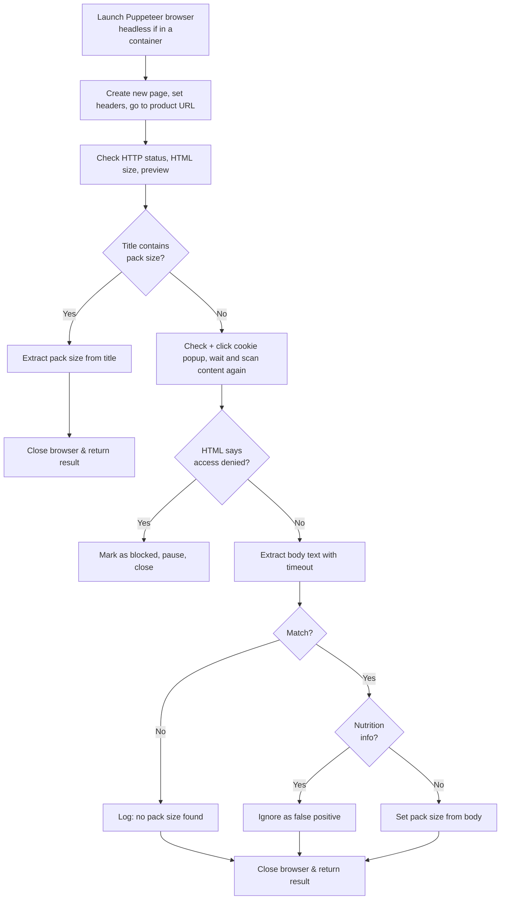

```mermaid
graph TD
B[Launch Puppeteer browser<BR>headless if in a <BR>container]
B --> C[Create new page, set headers, go to product URL ]
C --> E[Check HTTP status, HTML size, preview]
E --> F{Title contains<BR> pack size?}
F -- Yes --> G[Extract pack size from title] --> H[Close browser & return result]
F -- No --> J[Check + click cookie popup, wait and scan content again]

J --> K{HTML says<BR>access denied?}

K -- Yes --> L[Mark as blocked, pause, close]
K -- No --> M[Extract body text with timeout]

M --> N{Match?}
N -- No --> O[Log: no pack size found]
N -- Yes --> P{Nutrition<BR> info?}
P -- Yes --> Q[Ignore as false positive]
P -- No --> R[Set pack size from body]

R --> S[Close browser & return result]
O --> S
Q --> S
```
