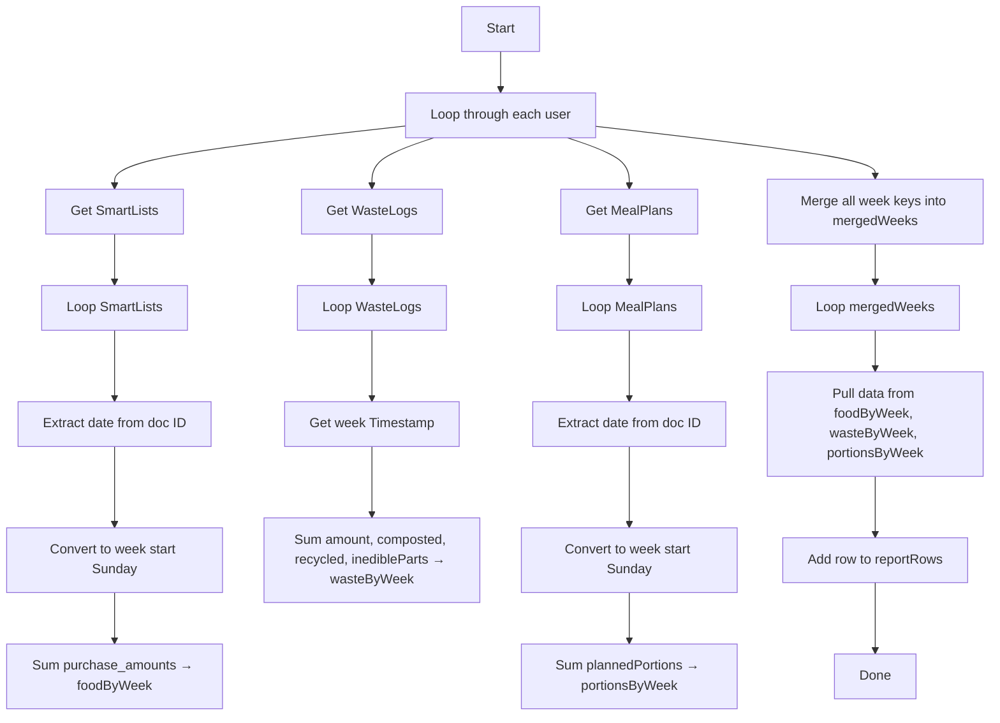

```mermaid
flowchart TD
    A[Start] -->  D[Loop through each user]
    D --> D1[Get SmartLists]
    D --> D2[Get WasteLogs]
    D --> D3[Get MealPlans]

    D1 --> E1[Loop SmartLists]
    E1 --> E2[Extract date from doc ID]
    E2 --> E3[Convert to week start Sunday]
    E3 --> E4[Sum purchase_amounts → foodByWeek]

    D2 --> F1[Loop WasteLogs]
    F1 --> F2[Get week Timestamp]
    F2 --> F3[Sum amount, composted, recycled, inedibleParts → wasteByWeek]

    D3 --> G1[Loop MealPlans]
    G1 --> G2[Extract date from doc ID]
    G2 --> G3[Convert to week start Sunday]
    G3 --> G4[Sum plannedPortions → portionsByWeek]

    D --> H[Merge all week keys into mergedWeeks]

    H --> I[Loop mergedWeeks]
    I --> J[Pull data from foodByWeek, wasteByWeek, portionsByWeek]
    J --> K[Add row to reportRows]

    K --> M[Done]
```